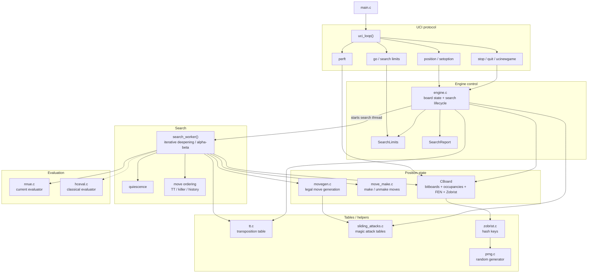

# Prophet

Prophet is a UCI chess engine written in C17.

## Architecture



## Project layout

```text
src/
├── main.c
├── board/
│   ├── cboard.c / cboard.h
│   └── zobrist.c / zobrist.h
├── core/
│   ├── bitboard.h
│   └── chess_types.h
├── engine/
│   ├── engine.c / engine.h
├── eval/
│   └── hceval.c / hceval.h
├── movegen/
│   ├── constant_attacks.c / .h
│   ├── constant_moves.c / .h
│   ├── move.c / move.h
│   ├── move_make.c / move_make.h
│   ├── movegen.c / movegen.h
│   ├── sliding_attacks.c / .h
│   └── sliding_moves.c / .h
├── nnue/
│   ├── nnue.c / nnue.h
│   └── nnue_config.h
├── perft/
│   └── perft.c / perft.h
├── search/
│   └── search.c / search.h
├── tt/
│   └── tt.c / tt.h
├── uci/
│   └── uci.c / uci.h
└── utils/
    └── prng.c / prng.h
```

### Module purpose

- `main.c`: starts the engine and hands control to the UCI loop.
- `board/`: stores complete position state, FEN conversion, board printing, and Zobrist hashing.
- `core/`: low-level chess types and bitboard helpers used everywhere else.
- `engine/`: coordinates board state, search lifecycle, hash management, and UCI-facing engine operations.
- `eval/`: classical hand-crafted evaluation based on piece values and positional terms.
- `movegen/`: generates legal and pseudo-legal moves, attack masks, and make/unmake helpers.
- `nnue/`: neural network evaluation support and configuration.
- `perft/`: move-tree counting and test harnesses for validating move generation.
- `search/`: iterative deepening, alpha-beta, quiescence, ordering, and time management.
- `tt/`: transposition table storage and probing for cached search results.
- `uci/`: parses UCI commands and translates them into engine actions.
- `utils/`: shared utilities, currently the PRNG used by hashing and initialization.

## Rough Roadmap

- [x] Benchmarking speed of search
- [ ] NNUE Training (seperate repo, not yet public)
- [ ] ELO estimation via self-play
- [x] Connection to Lichess API for online play and testing

## Credits

  Influenced by [Chess Programming Wiki](https://www.chessprogramming.org/Main_Page) patterns and references (PeSTO-style evaluation, magic bitboards, Zobrist workflows) and [Stockfish](https://github.com/official-stockfish/Stockfish/).
